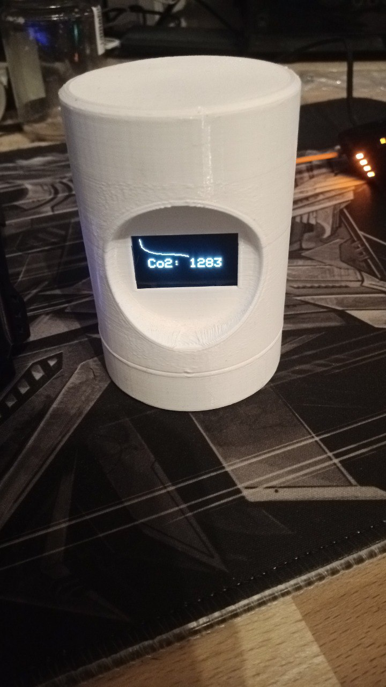

# ESP8266-AirSensor
A AirSensor running on an ESP8266 D1 Mini Lite, using the SCD30 to collect CO² data from the air and displaying it on a 128x64px OLED (i2c) display, 
for extra usability also uses a lightstrip to display/categorize the CO² value

the CO² value allways refers to the average of the last 5 collected CO² values

<video width="630" height="300" src="img/video.mp4"></video>

